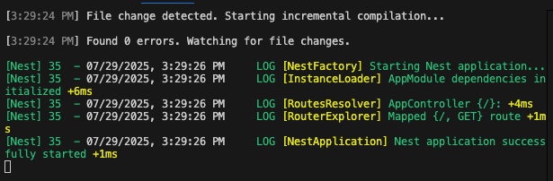
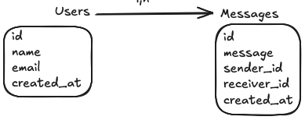

# chat-nestjs

- Chat criado com NestJs

# Regras de negócio

- Usuário faz login para ter acesso ao recurso do chat
- Usuário visualiza contatos online
- Usuário envia mensagem para contato
- Usuário recebe mensagem de contato

# Stack

- NestJs
- PostgreSql

# Executar aplicação

```shell
docker compose up -d
```

- [Chat](http://localhost:3000/)
- [Adminer](http://localhost:8080)

# Acessar container da aplicacao chat

```shell
docker attach nest-chat
```



# Executar migrations

```shell
docker exec -it nest-chat sh 
npm run build
typeorm migration:run -d dist/database/orm-cli-config.js

typeorm migration:revert -d dist/database/orm-cli-config.js
```


